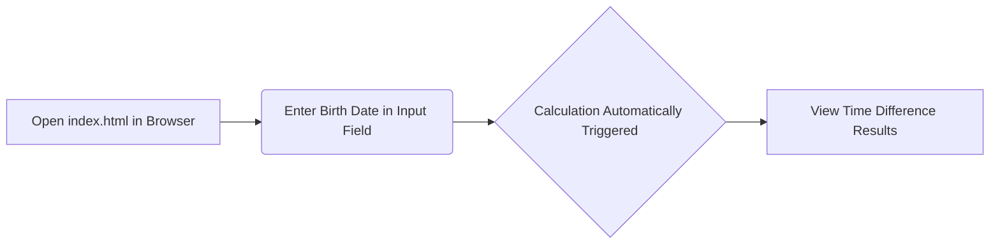

# Birthday Calculator Documentation

## Overview

The Birthday Calculator is a simple web application that helps you calculate the time difference between two dates, specifically useful for finding out how many days, weeks, months, or years are between your birth date and today's date.

## How to Use

1.  **Open the Application:** Navigate to the `birthdaycalc` folder within the downloaded repository. Open the `index.html` file in your web browser.

2.  **Enter your Birth Date:** You will see two date input fields. The first field is labeled "Enter your birthday:". Click on this field to open a date picker. Select your birth date (day, month, and year).

3.  **Calculate:** After selecting your birth date, the application automatically calculates and displays the time difference between your birth date and the current date.

4.  **View Results:** The results are displayed below the date input fields, showing the difference in:
    *   Years, months, and days
    *   Total months and days
    *   Total weeks and days
    *   Total days

## Diagram

This diagram illustrates the simple flow of using the Birthday Calculator. You open the `index.html` file, enter your birth date, and the application automatically displays the calculated time difference.
