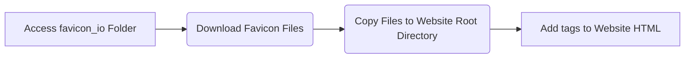

# Favicon Generator Documentation

## Overview

The Favicon Generator is a web application that helps you create favicons for your website. Favicons are small icons that are displayed in the browser tab next to the website title. This tool helps you generate favicons in various sizes and formats to support different devices and browsers.

## How to Use

1.  **Open the Application:** Navigate to the `favicon_io` folder in the repository. Open the `index.html` file in your web browser.

2.  **About Page:** The `index.html` file appears to be an about page, not the favicon generator itself.  This project seems to be a collection of favicon files, likely generated using an online service (favicon.io). 

3.  **Using the Provided Favicons:** You can use the provided favicon files directly for your website. Here's how:
    *   **Download the files:** Download the contents of the `favicon_io` folder.
    *   **Integrate into your website:** Copy the favicon files (e.g., `favicon.ico`, `apple-touch-icon.png`, `favicon-32x32.png`, etc.) into the root directory of your website.
    *   **Link in your HTML:** Add the necessary `<link>` tags in the `<head>` section of your website's HTML file to link to these favicon files.  Example:

        ```html
        <link rel="apple-touch-icon" sizes="180x180" href="/apple-touch-icon.png">
        <link rel="icon" type="image/png" sizes="32x32" href="/favicon-32x32.png">
        <link rel="icon" type="image/png" sizes="16x16" href="/favicon-16x16.png">
        <link rel="manifest" href="/site.webmanifest">
        <link rel="shortcut icon" href="/favicon.ico">
        ```

    *   **Note:** Adjust the `href` paths in the `<link>` tags if you place the favicon files in a different directory within your website.

## Diagram



This diagram shows how to use the favicon files provided in the `favicon_io` folder.  Since this project is a collection of pre-generated files rather than an application, you download and integrate these files directly into your website project.
